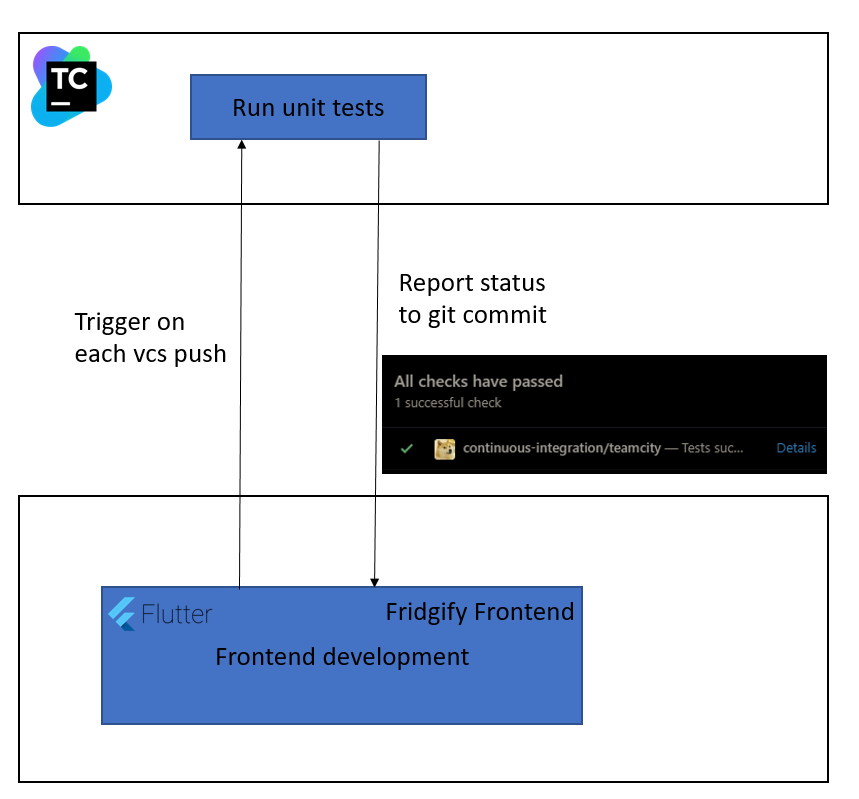
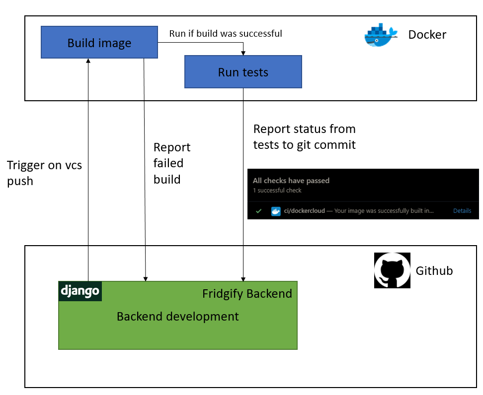
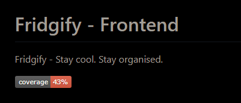
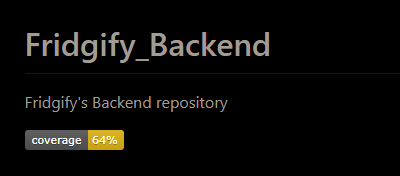
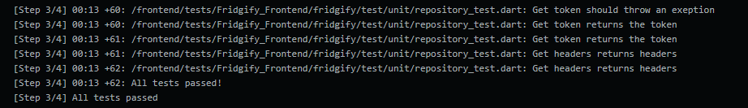
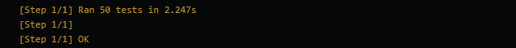

# PHASE 2 WEEK 4 - TESTING AND BADGES
\
Another week, another blog. This week is about testing and code coverage. Our goal to write the best code possible
forced us to write tests from day one. This benefited us on many occasions because we automated this as soon as we had 
a small suit of tests to execute. Our task was easy for this week. We only have to present what we already have and
create code coverage badges to further illustrate our current test suit. So no more talking, more showing.

## Testing
\

\
Our frontend tests run on our teamcity server as soon as someone pushes onto any branch in our frontend repository. The 
result of these tests are displayed as a status of the commit. Flutter offers a great built in test framework that offers
a wide range of possibilities to test our app. The tests can be found in the 
[test directory](https://github.com/Fridgify/Fridgify_Frontend/tree/develop/fridgify/test).
\
\

\
\
Testing in the backend works a bit different from our frontend. We are using docker to publish our backend api, with 
our own docker hub organisation [Fridgify](https://hub.docker.com/repository/docker/fridgify/fridgify). We are using the 
built in image testing of docker hub. This works as follows. Each push on a feature branch triggers an image build on 
docker hub. Docker hub runs our tests, if the build is successful and reports either passing tests or that the build 
failed or that a test failed. This is represented in the commit status of git commits. Our tests can be found in the 
[test directory](https://github.com/Fridgify/Fridgify_Backend/tree/master/Fridgify_Backend/tests).
\
## Badges
\
Our code coverage badge creation is automated to update the badge each time someone pushes a change. Our badges can be 
found on the README`s in the [backend](https://github.com/Fridgify/Fridgify_Backend/blob/develop/README.md) and 
[frontend](https://github.com/Fridgify/Fridgify_Frontend/blob/develop/README.md) repository. But I know everyone is to 
lazy to click on the links so here are pictures.
\
\

\
We used three packages to generate these badges. ``flutter_coverage_badge`` did the trick with flutter and 
``django-nose`` and ``coverage-badge`` helped with python and django.
\                                                                                                          
We know that the coverage numbers are low, and we are working to increase them. Expect higher numbers in the following 
weeks.
\
If you dont believe that our tests are passing by now, here are screenshots to satisfy the tinfoil heads.
\
\
Frontend
\

\
\
Backend
\

\
\
This was all from us this week, see you next week. Unitl then ...
\
\
*Stay cool. Stay organised*
\
-Your **Fridgify Team**

