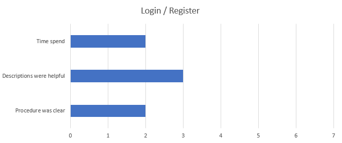

# Update - User test
After realeasing our app as an alpha to selected users, we handed out a short questionare about our app. But we know that everyone hates long questionaires. We limited ourselves to three short questions that we apply to different parts of our app. The three questions are:
- Procedure was clear
- Descriptions were helpful
- Time spend
 

We asked these questions about the following parts of our app.
- Login / Register
- Creating a fridge
- Adding items to a fridge
- Change items of a fridge
 

These questions can be answerd from 1 to 7. 1 being good, 7 being bad and 4 being neutral.

 

The questionare shows that we achieved a good usability and only need to improve descriptions when adding items to a fridge. We are really happy with the outcome of this questionare and are eager to hear your feedback once we release officialy.  