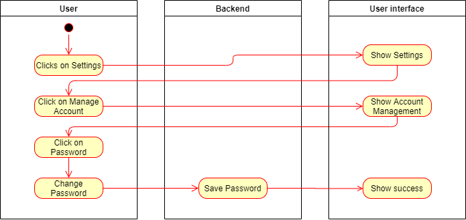
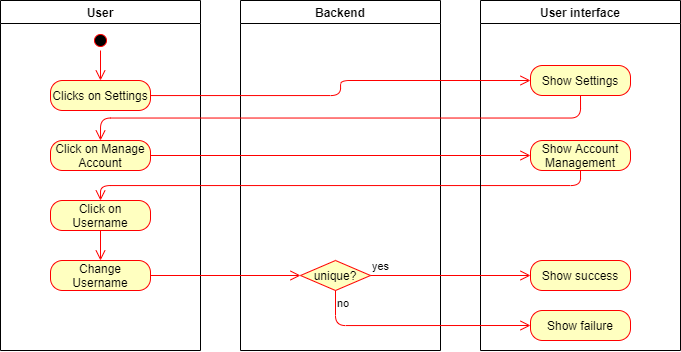
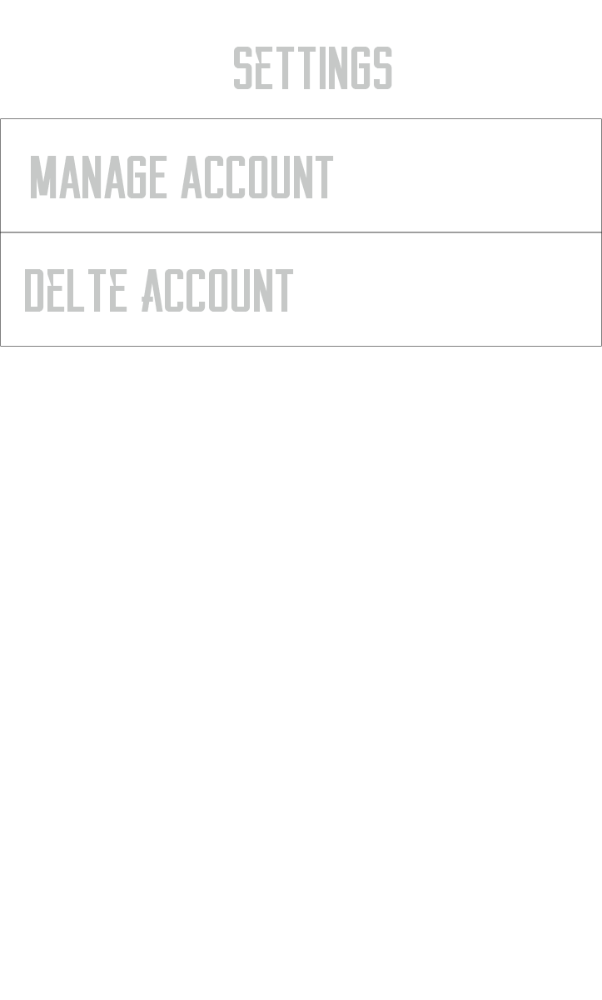

# Fridgify

## Use-Case Specification: Manage Account

## 1. Manage Account

### 1.1 Brief Description

The **Manage Account** Use Case depicts a workflow, where users are able to change certain account settings such as their password and their username. 

## 2. Flow of Events

### 2.1 Change Password

A user clicks on *Settings*. He proceeds to move to *Manage Account* inside of the *Settings*-View. Inside of the management view, the user selects his password and continues to change it. Afterwards he submits the change and the password is changed.

### 2.1.1 Activity Diagram

### 2.2 Change Username

A user clicks on *Settings*. He proceeds to move to *Manage Account* inside of the *Settings*-View. Inside of the management view, the user selects his usernameand continues to change it. Afterwards he submits the change and the username is changed, when it does not already exists.

### 2.2.1 Activity Diagram

## 2.3 Mock Up

## 3. Special Requirements

What out of the ordinary is required 

## 4. Preconditions

### 4.1 Authenticated

The user has to be authenticated to change his data.

## 4.2 Internet Connection

To communicate with the backend an internet connection is required.

## 5. Postconditions

### 5.1 Response

The user interface has to show a form of feedback (either successful change or not).

## 6. Extension Points

**n / a**