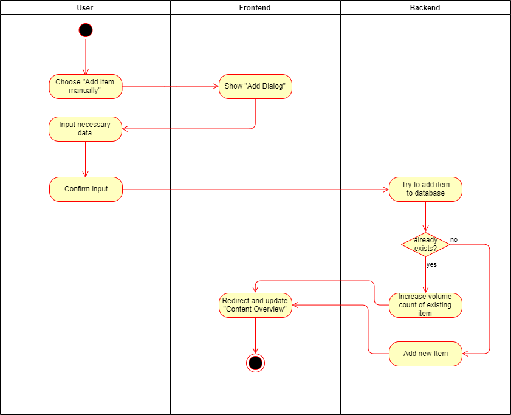
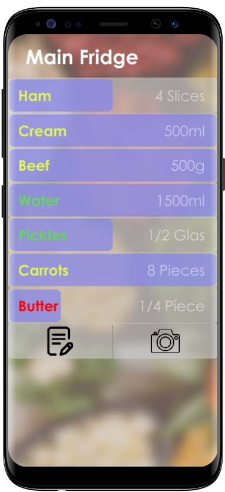
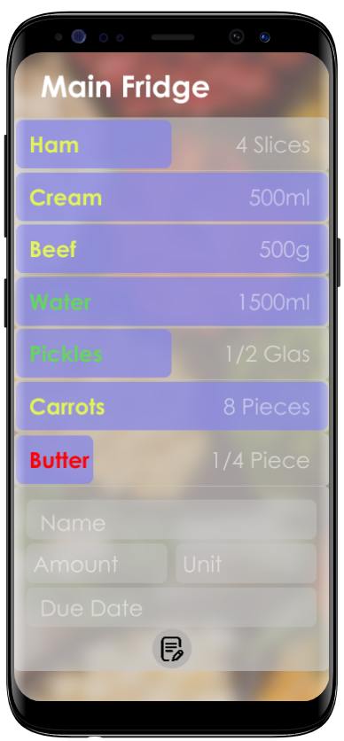

# Fridgify

## Use-Case Specification: Add Content

## 1. Add Content

### 1.1 Brief Description

Every user is able to add items to a specific fridge. Each item has a certain volume value, a certain increment and a name. Items can be added manually as well as per barcode scanning.

## 2. Flow of Events

### 2.1 Basic Flow

#### Add manually

An item can be added manually. The user decides to add an item manually, so he chooses the according button. After clicking on the said button, a dialog opens up, asking him to add the required information. The information is being sent to the backend, where it is added to the database if it is not already existing. If the to be added item does already exist, the volume of the according item is being increased. After that, the user is being redirected to an update "Fridge Content Overview".

#### Add with Barcode Scanning

An item can be added by scanning the barcode of an item. The user chooses the button to add an item by barcode scanning. He is being redirected to a camera view, where he is able to scan the barcode. If it is being recognized, the item is being added to the database, after adding some more information. If it is not successful, the user is being redirected to the "Content Overview" and the flow for Adding Manually is being started. The user is being redirected to an updated version of the "Fridge Content Overview".

### 2.1.1 Activity Diagram

#### Add manually



#### Add with Barcode Scanning


### 2.1.2 Mock Up




### 2.1.3 Feature File

``` .feature
Feature: Content Screen
  The User is on the fridge content screen
  
  Scenario: I add item manual
    Given I see screen "fridge"
    When I tap the "manual" button
    Then I see dropdown "addItem"

  Scenario: I add item with scan
    Given I see screen "fridge"
    When I tap the "scan" button
    Then I see screen "scan"
```

## 3. Special Requirements

n/a

## 4. Preconditions

### 4.1 Authentication

The user has to be logged into the system. He has to be authenticated to be able to communicate with the backend, otherwise getting content is not possible.

### 4.2 Access Rights

The user has to have access rights to the chosen fridge. Otherwise the backend is not able to retrieve the required data and this use case is not fulfillable.

### 4.3 Internet Connection

The user has to have a stable internet connection. If in any case the user does not have an internet connection, communication with the backend will certainly fail.

## 5. Postconditions

### 5.1 Returning

After deleting an item, whether successfully or unsuccessfully, the user should be redirected to the "Fridge Content Overview". 

### 5.2 Cache

After deleting an item successfully the current overview of items should be cached and the old one deleted.

## 6. Extension Points

n/a

## 7 Feature Files
### 7.1 Url to feature files
[content.feature](https://github.com/Fridgify/Fridgify_Frontend/blob/working/featurefiles/fridgify/test_driver/features/content.feature)