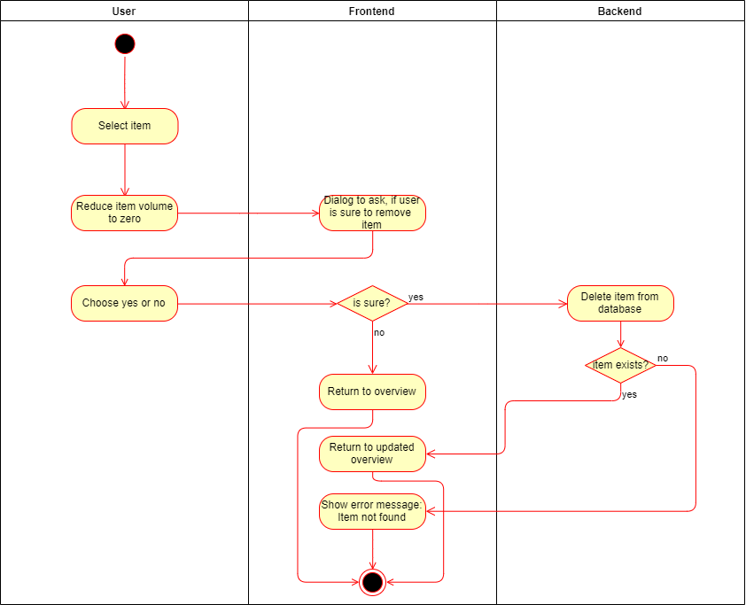

# Fridgify

## Use-Case Specification: Remove Fridge Content

## 1. Remove Fridge Content

### 1.1 Brief Description

Every user is able to manage his own fridge. Managing a fridge and its content requires him to be able to delete/remove items easily. Each user has the ability to remove each item individually from the "Fridge Content Overview".

## 2. Flow of Events

### 2.1 Basic Flow

In the "Fridge Content Overview" an user is able remove specific items. To do so he has to set the content's volume to zero, implying that it is empty. Every empty item is automatically deleted, after securing, that there was an actual intent to delete said item. After successfully deleting the item, the user is redirected to an updated version of the "Fridge Content Overview".


#### 2.1.1 Activity Diagram



#### 2.1.2 Mock Up

)

#### 2.1.3 Feature File

``` .feature
Feature: Remove Item

Scenario: Remove Item manually - Verification
    Given user is authenticated for fridge
    And fridge is not empty
    And chosen item exists
    When user changes item volume of chosen item to zero
    Then show message box asking if user is sure to remove item

Scenario: Remove Item manually - Confirmed
    Given user is authenticated for fridge
    And fridge is not empty
    And chosen item exists
    And verification message box is shown
    When user confirmes removal
    Then send delete task to backend
    Then redirect to "Content Overview"-Page
    Then update list

Scenario: Remove Item manually - Canceled
    Given user is authenticated for fridge
    And fridge is not empty
    And chosen item exists
    And verification message box is shown
    When selects "Cancel"
    Then close message box
    And set volume to value before change

Scenario: Remove Item automatically (expired)
    Given item exists
    And fridge is no empty
    When item expired
    Then send notification to user - "Item A expired"
    And send delete action to backend
    And update cached list if necessary
```

## 3. Special Requirements

n/a

## 4. Preconditions

### 4.1 Authentication

The user has to be logged into the system. He has to be authenticated to be able to communicate with the backend, otherwise getting content is not possible.

### 4.2 Access Rights

The user has to have access rights to the chosen fridge. Otherwise the backend is not able to retrieve the required data and this use case is not fulfillable.

### 4.3 Internet Connection

The user has to have a stable internet connection. If in any case the user does not have an internet connection, communication with the backend will certainly fail.

## 5. Postconditions

### 5.1 Returning

After deleting an item, whether successfully or unsuccessfully, the user should be redirected to the "Fridge Content Overview". 

### 5.2 Cache

After deleting an item successfully the current overview of items should be cached and the old one deleted.

## 6. Extension Points

n/a

## 7 Feature Files
### 7.1 Url to feature files
[content.feature](https://github.com/Fridgify/Fridgify_Frontend/blob/working/featurefiles/fridgify/test_driver/features/content.feature)