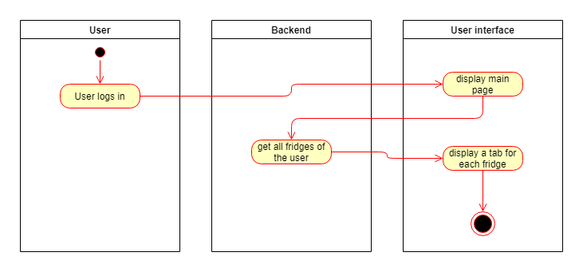
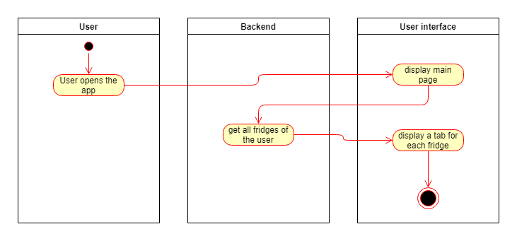
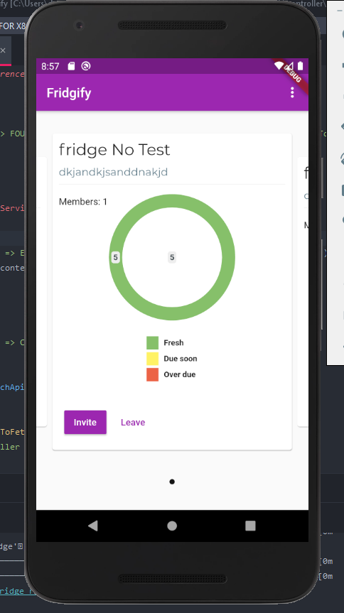
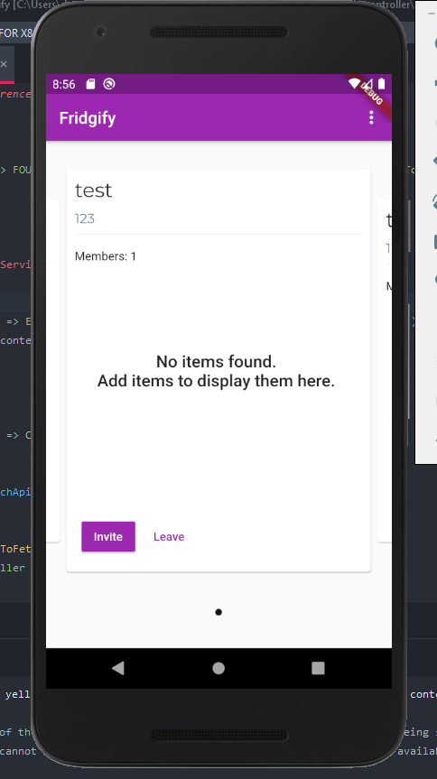

# Fridgify

## Use-Case Specification: Get Fridges

## 1. Get Fridges

### 1.1 Brief Description
To view or manage all fridges the user has to have an option to view all of his fridges. The workflow for this should be as short as possible and intuitive. 

## 2. Flow of Events

### 2.1 Basic Flow

The user needs to log into the app. All fridges connected to the account are being retrieved after a successful login. The fridges are displayed as a clickable panel on the main page. Nothing gets displayed if the user has no connected fridges.

### 2.1.1 Activity Diagram



### 2.1.2 Mock Up

**n/a**

### 2.2 Alternativ Flow

The app jumps instantaneously onto the main page if the user has already logged into the app. All connected fridges get therefore displayed immediately.

### 2.2.1 Activity Diagram




### 2.2.2 Mock Up




### 2.3 Feature File
```gherkin
Feature: Overview Screen
  The User is on the Fridge Overview Screen

  Scenario: The User opens a Fridge
    Given I see "overview"
    When I click the fridge
    Then I see screen "fridge"

  Scenario: The User opens Fridge Menu
    Given I see "overview"
    When I hold the fridge for 3 seconds
    Then I expect update "fMenu"
```

## 3. Special Requirements

### 3.1. Owning an account

In order to view his fridges the user has to have an account. Only if he has one he will be able to view all fridges connected to the account.

## 4. Preconditions

### 4.1 The user downloaded the app 

The user has to have already downloaded the app.

## 5. Postconditions

### 5.1 The user sees his fridges

The user has know the option to view and manage his fridges.

## 6. Extension Points

**n / a**
