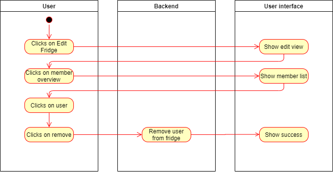
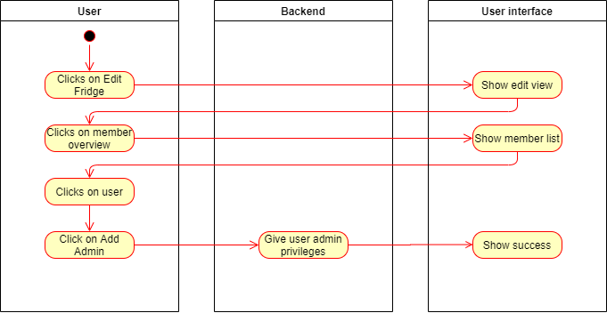
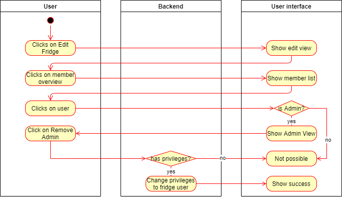
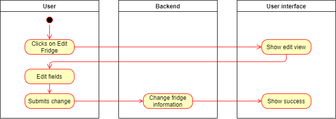
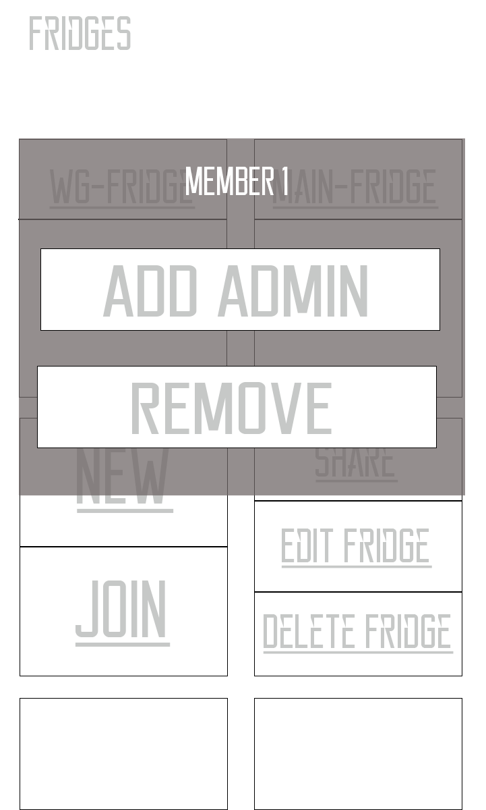
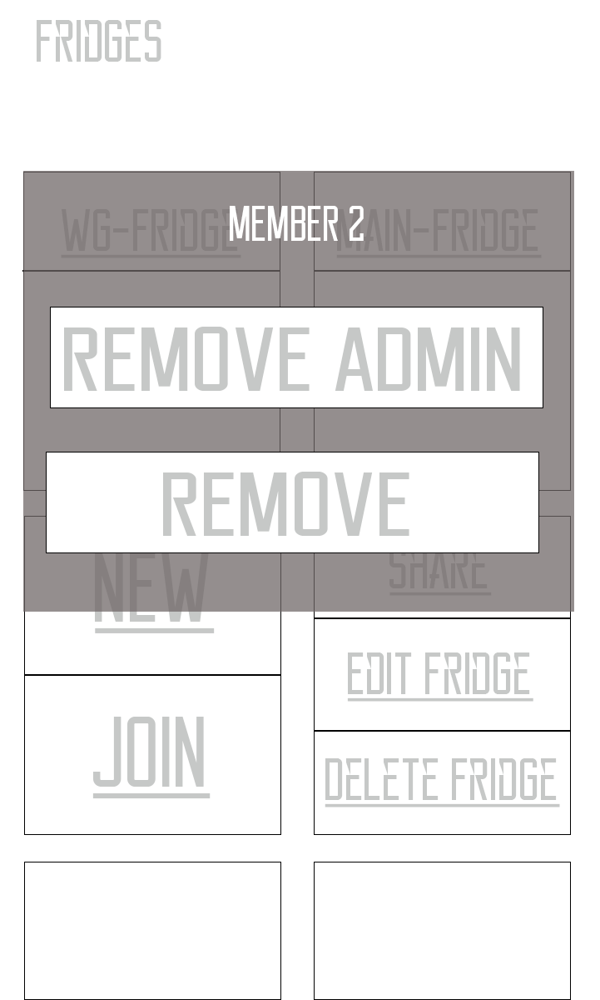
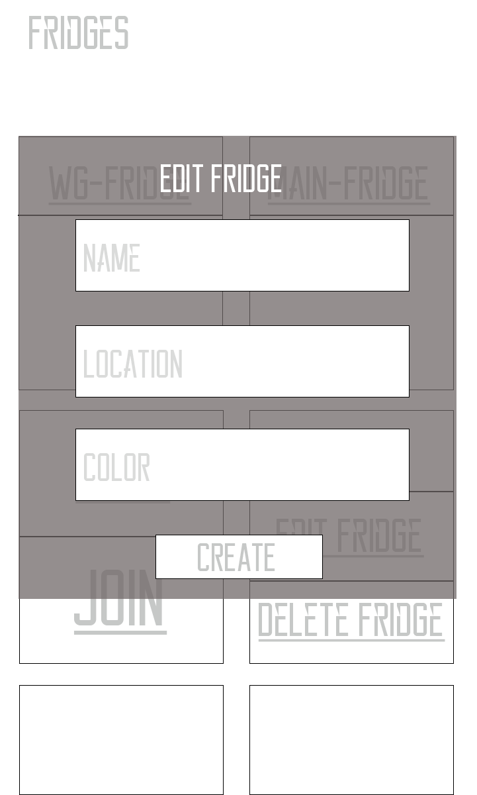

# Fridgify

## Use-Case Specification: Manage Fridge Members

## 1. Manage Fridge Members

### 1.1 Brief Description

Managing Fridge Members allows users to add and remove users from fridges, declare admins and remove admins as well as editing fridge information as an owner.

## 2. Flow of Events

### 2.1 Remove Fridge User

### 2.1.1 Activity Diagram

### 2.2 Add Admin

### 2.2.1 Activity Diagram

### 2.3 Remove Admin

### 2.3.1 Activity Diagram

### 2.4 Edit Fridge

### 2.4.1 Activity Diagram

### 2.2.2 Mock Up

 [Selected User is Fridge User]   

 [Selected User is Admin]   

## 3. Special Requirements

What out of the ordinary is required 

## 4. Preconditions

### 4.1 Authenticated

User is authenticated.

### 4.2 Access to fridge

The user has access to the fridge

### 4.3 Admin Privileges [Add admin | Remove user]

The user has to be an admin in the fridge to add an admin.

### 4.4 Owner Privileges [Remove admin | Edit fridge]

The user has to be the fridge owner to remove an admin or edit a fridge.

## 5. Postconditions

### 5.1 Response

Always show a feedback view no matter if the request was successful or not.

### 5.2 Privileges

Changing privileges for a user should result in having the appropriate privileges for the fridge for said user.

## 6. Extension Points

**n / a**

## 7 Feature Files
### 7.1 Url to feature files
[overview.feature](https://github.com/Fridgify/Fridgify_Frontend/blob/working/featurefiles/fridgify/test_driver/features/overview.feature)